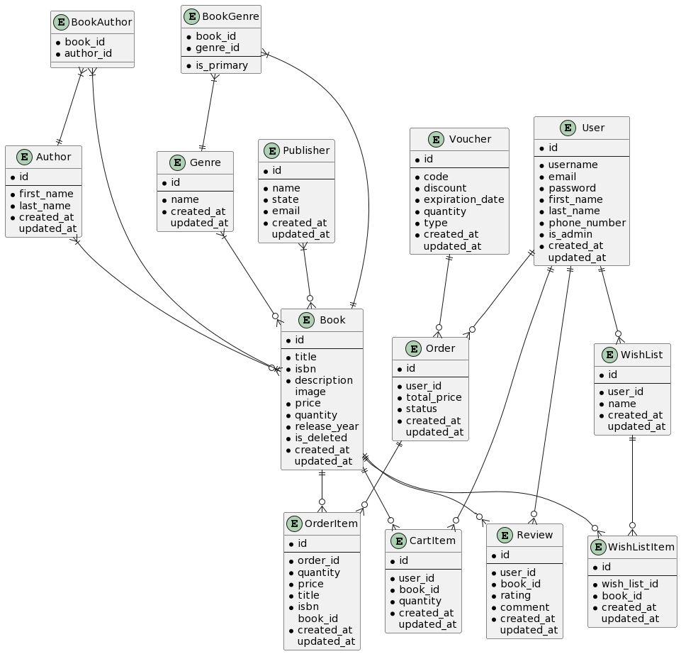

# PV179 - BookHub
This GitLab repository contains the code and documentation for the PV179 project. 

The project's goal is to develop a digital platform for the company called "BookHub", a company that sells 
books of various genres. 

The platform should facilitate easy browsing and purchase of books, letting customers 
sort and filter by authors, publishers, and genres. After customers create accounts, they should be able to review 
their purchase history, rate books, and make wishlists. Administrators should have privileges to update book 
details, manage user accounts, and regulate book prices.


### Prerequisites

- .NET 7.0 or later
- Visual Studio / Rider

### Installation

1. Clone the repository to your local machine.
    ```
    git clone git@gitlab.fi.muni.cz:xkraus2/pv179-bookhub.git
    ```
2. Open the solution file `BookHub.sln` in editor of your choice.
3. Build the solution to restore NuGet packages and compile the project.

## Usage

### Visual Studio

To run the application from within Visual Studio, follow these steps:

1. Open the `BookHub` project in Visual Studio.
2. In the toolbar, select `Debug` and then `Start Without Debugging`.
3. SwaggerUI should open automatically.

### Rider

To run the application from within Rider, follow these steps:

1. Open the `BookHub` project in Rider.
2. In the toolbar select `Run Bookhub http/https`.
3. SwaggerUI should open automatically.

### Command line

To run the application from within command line, follow these steps:

1. Execute command `dotnet run <path_to_bookhub_project>`.
2. After successful startup, the IP address with port will be outputted to the console.
3. You can connect to SwaggerUI on url `<IP:port_from_output/swagger/index.html>`.

## Configuration

### Logging

By default, BookHub logs incoming requests to standard output in a shortened version:\
`(Timestamp | IP:Port | HTTP method | URL path )`.

Alternatively, the logging can be extended by listing the request headers in the `appsettings.json` file 
in the `Logging:RequestLogging` section by setting `Detailed` to `true`.

### API authenticating

TODO

## Technical overview

Our C# project is structured with a layered architecture, consisting of a Data Access layer, 
Presentation layer and Business Layer. These layers work in tandem to deliver the core functionality of the application.

**Data Access Layer**:
- We use Entity Framework as our ORM (Object-Relational Mapping) framework to interact with the 
underlying database. 
- Currently, our database is implemented using SQLite, a lightweight, file-based relational 
database management system. 
- Database schema is visualized by a [Entity Relationship Diagram](#erd).
**Business Layer**: TBA

**Presentation Layer**: TBA


## Diagrams

### Use Case


### ERD


